# Реверс-инжиниринг IoT: от UART до root-бэкдора

**Внимание: Данный материал создан исключительно в образовательных и исследовательских целях. Все манипуляции проводились на личном оборудовании автора. Несанкционированный доступ к чужим системам преследуется по закону.**

- [Этап 0: Выбор устройства](#этап-0-выбор-устройства)
- [Этап 1: Разведка и препарирование пациента](#этап-1-разведка-и-препарирование-пациента)
- [Этап 2: Слушаем эфир и ловим U-Boot](#этап-2-слушаем-эфир-и-ловим-u-boot)
- [Этап 3: Художественный фильм - "Сдампили"](#этап-3-художественный-фильм---сдампили)
- [Этап 4: Эволюция окружения - от "комы" к живой системе](#этап-4-эволюция-окружения---от-комы-к-живой-системе)
- [Этап 5: Автоматизация и закрепление бэкдора](#этап-5-автоматизация-и-закрепление-бэкдора)
- [Итоги](#итоги)
- [Бонус](#бонус)

Современные IoT-устройства, несмотря на компактные размеры и ограниченные ресурсы, представляют собой полноценные embedded-системы. Под пластиковым корпусом бюджетного гаджета часто скрывается стандартный Linux-компьютер с собственным ядром, драйверами, файловыми системами и сетевыми службами.

Статья посвящена проведению полного цикла реверс-инжиниринга типовой IP-камеры: от аппаратного анализа печатной платы до закрепления в операционной системе с root-правами.

Разберём путь от подключения к внутренним отладочным интерфейсам устройства до реализации устойчивого удаленного root-доступа по Wi-Fi. На примере IP-камеры Aceline AIP-O4 наглядно рассмотрим типовую архитектуру бюджетного IoT-девайса и классические ошибки, допускаемые вендорами при проектировании безопасности.

### TL;DR - если не хочется читать целиком

Было проведено реверс-исследование IP-камеры Aceline AIP-O4.
Через UART был получен доступ к загрузчику U-Boot,
после чего параметр `init` был изменён на `/bin/sh` и получен доступ в root-консоль.

Далее была обнаружена возможность выполнения произвольных shell-скриптов через `/var/syscfg/test.sh` в read-write разделе файловой системы.

Результат:
 - получен полный root доступ через telnet shell по Wi-Fi
 - внедрён бэкдор устойчивый к перезагрузкам
 - найдена уязвимость path traversal в веб-сервере
 - сохранена штатная работоспособность устройства

## Этап 0: Выбор устройства

Первым делом нужно определиться с подопытным, поэтому я выделил вот такие критерии для выбора устройства:
- **Цена 1000-1500 руб.**, чтобы было не так жалко, если вдруг случайно сделаю "кирпич".
- **Не очень высокая предполагаемая степень защиты**. Если будет чрезмерно сложно, интересный эксперимент превратится в пытку и тяжёлую нудную работу, что убьёт весь энтузиазм и любопытство.
- **Богатый функционал и разнообразие периферии**. Это даст более широкий простор для экспериментов.

Выбор пал на IP-камеру Aceline AIP-O4, и вот что у неё на борту:

- Камера
- Микрофон
- Динамик
- ИК-подсветка
- Слот для SD-карты
- Wi-Fi (как точка доступа, так и подключение к другой сети)

На борту урезанная версия Linux - маленький, слабенький, но всё-таки настоящий компьютер с настоящей ОС.

Камера была куплена 07.03.2026 за 950 руб. в магазине DNS.

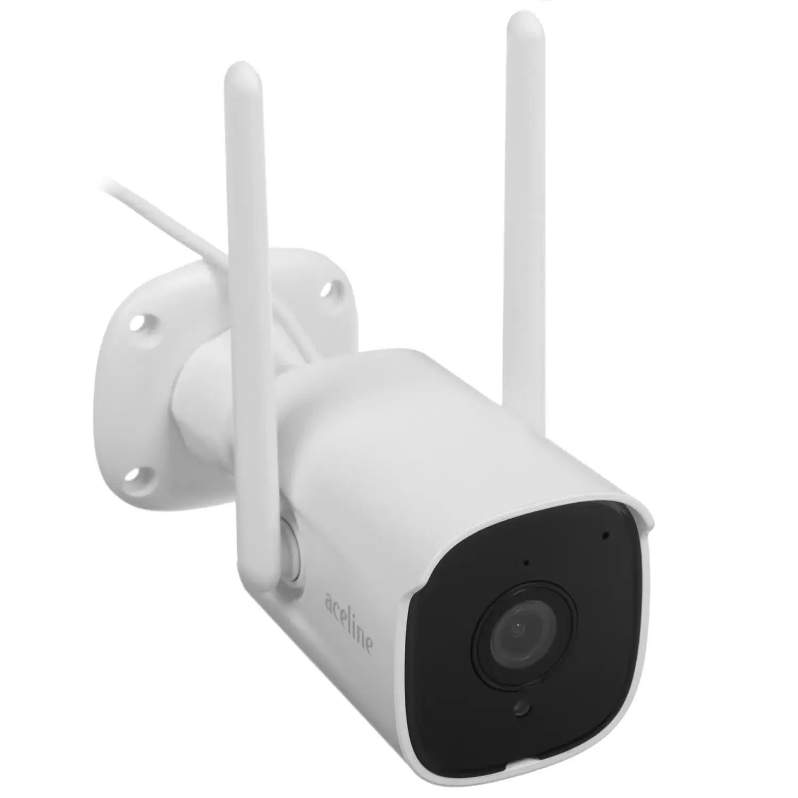
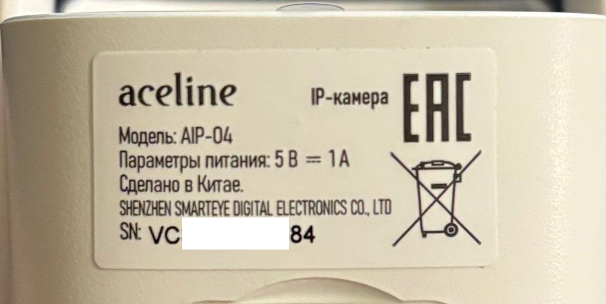

Для дальнейшей работы мне понадобились такие инструменты:
- Отвертки, пластиковая лопатка для ремонта электроники (чтобы аккуратно поддеть детали корпуса), 3 шт. Dupont проводов, гелевая клейкая лента (не проводит ток, клеится легко, очень плотно прижимает провода к UART контактам - пайка не нужна)
- Arduino UNO (как UART-мост) или отдельный USB-TTL адаптер на FT232BL/RL
- Программатор CH341A с прищепкой SOP8
- MicroSD карта любого объёма
- Софт: PuTTY, NeoProgrammer, binwalk

## Этап 1: Разведка и препарирование пациента

Любой hardware-анализ начинается с отвертки. Пластиковой лопаткой или медиатором поддеваем тонированную панель на передней части камеры, выкручиваем два винта и аккуратно извлекаем внутренности. Важно не повредить тонкие шлейфы, идущие к микрофону и Wi-Fi антенне.

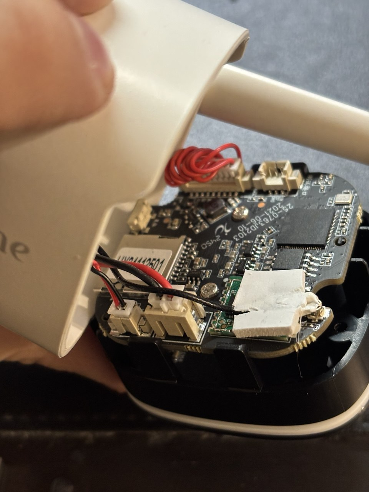

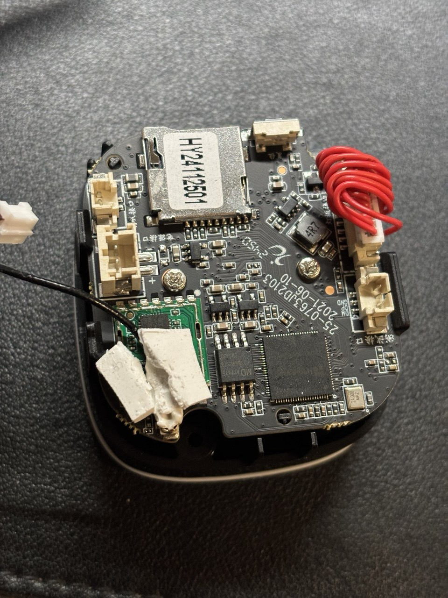

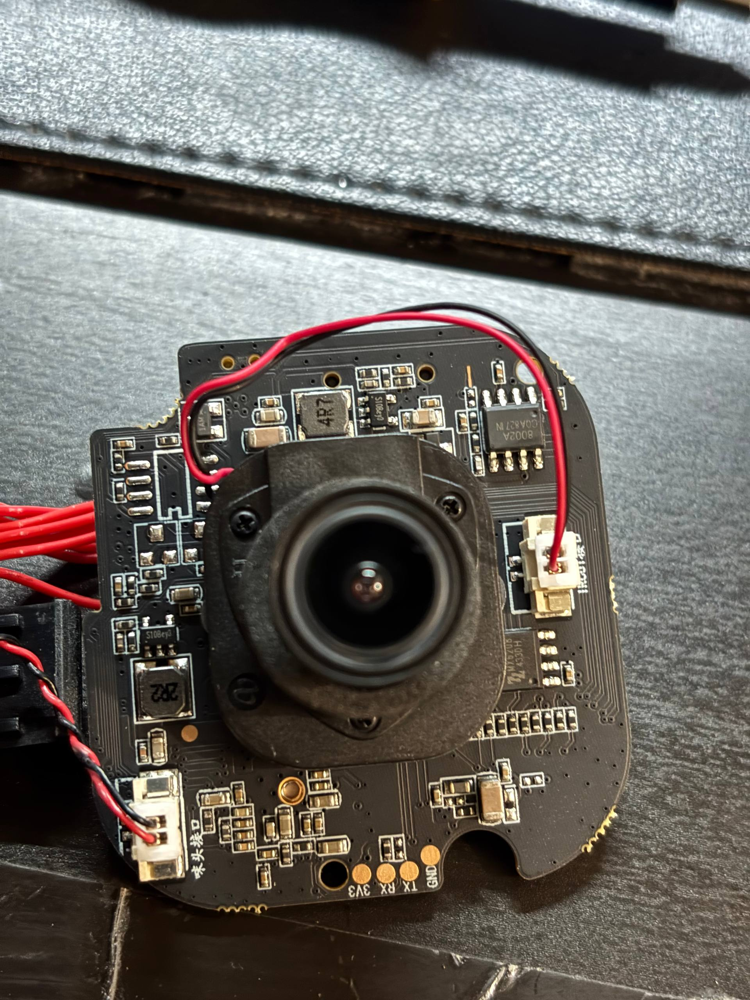

Отсоединив периферию, мы получаем доступ к основной плате. Нас интересует "Святая Троица" IoT-устройств: **процессор (SoC)**, **SPI Flash** память и отладочный интерфейс **UART**. На фото отлично видно всех троих: самый большой чип - это SoC, рядом с ним SPI Flash с 8 ножками, а на обратной стороне платы расположились 4 медных контакта UART.

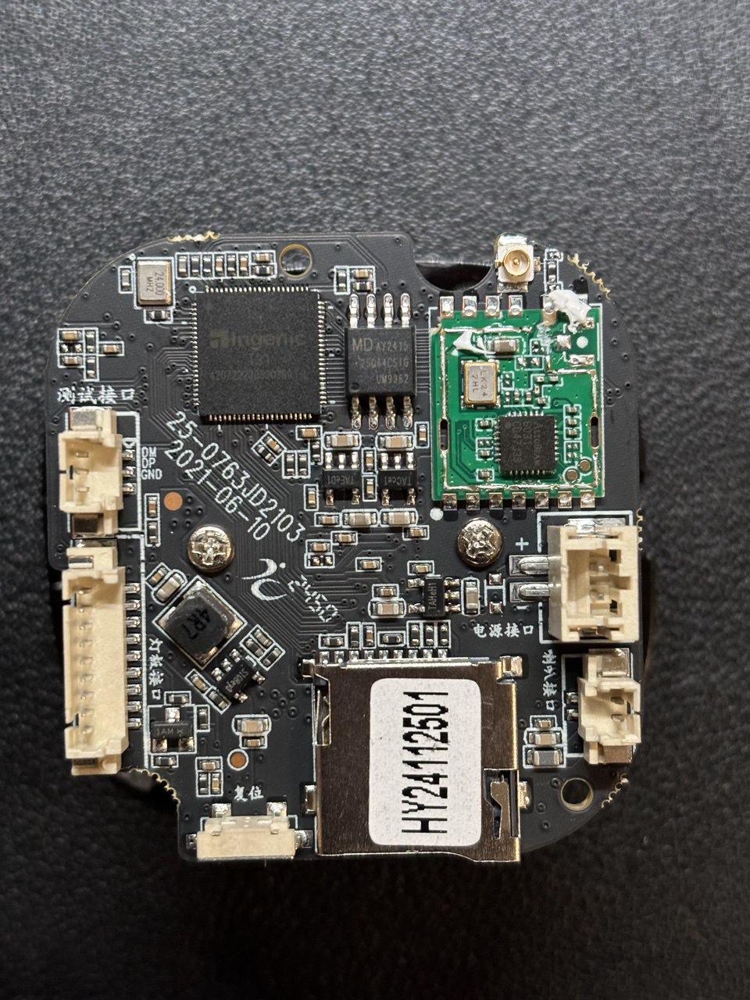

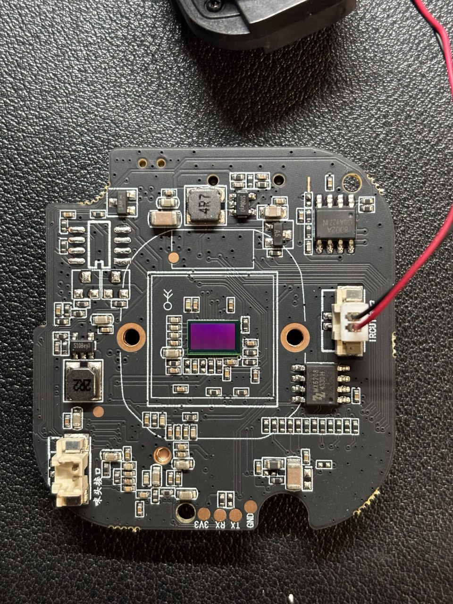

**Идентификация компонентов:**
*   **SoC:** `Ingenic XBurst T31`. Архитектура MIPS32. Популярный и дешевый чип для видеоаналитики.
*   **Flash-память:** 8-пиновая микросхема `GD25Q64CSIG` (GigaDevice). Это SPI NOR Flash объемом 64 Мегабита (8 Мегабайт). Питание логики - 3.3V. Здесь хранится загрузчик, ядро и вся файловая система.
*   **UART:** На плате любезно оставлена нераспаянная гребенка из четырех контактов, подписанная как `GND, TX, RX, 3V3`. Бинго.

## Этап 2: Слушаем эфир и ловим U-Boot

Прежде чем что-то менять, нужно понять, что вообще происходит под капотом при старте устройства.

Пока ждал доставку нормального программатора, я собрал колхозный UART-мост из Arduino UNO для первичного "прослушивания" логов загрузки. **Сначала замыкаем RST и GND на Arduino**, чтобы отключить микроконтроллер от шины UART и сделать USB-UART мост от USB порта компьютера до UART на плате камеры. Dupont провода подсоединяем к контактам UART на плате - TX (Transmit) камеры к TX Arduino, ну и GND (Ground) --> GND, разумеется. 

>**Обратите внимание на то, как UART устройства подключаются к пинам Arduino в роли UART-моста:** не TX к RX (Receive), а именно **TX к TX**. Замыкание RST на GND отключает основной микроконтроллер (ATmega) от шины, и мы начинаем напрямую общаться с чипом USB-TTL, встроенным в плату Arduino. Именно поэтому пин TX на Arduino (который физически ведет к RX USB-чипа) должен подключаться к TX целевого устройства.
>
>В обычных UART соединениях используется TX→RX.

Подключение к UART позволило увидеть логи загрузчика в реальном времени, и понять, что мы на верном пути.

>**Важно:** Arduino оперирует 5-вольтовой логикой, а SoC камеры работает на 3.3V. Если бы мы соединили TX Arduino с RX камеры для отправки команд в терминал, мы бы с высокой вероятностью **сожгли процессор**. Поэтому при помощи Arduino (*без использования резисторов*) мы можем только посмотреть логи.

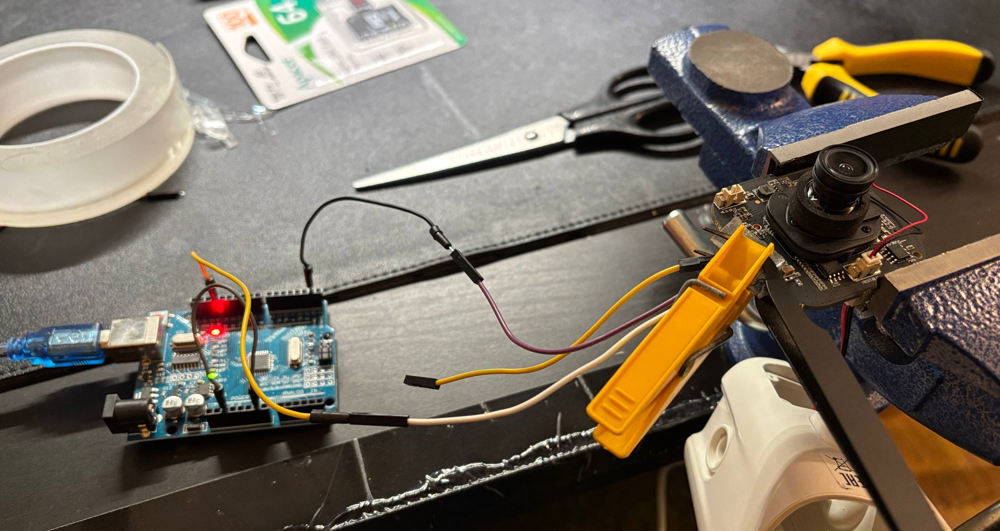

Позже я перешел на классический USB-to-TTL адаптер (FT232BL). Намного удобнее, стабильнее и компактнее.

>*Подключение: GND к GND, TX к RX, RX к TX - тут уже всё стандартно. Питание подается штатно от блока питания камеры.*

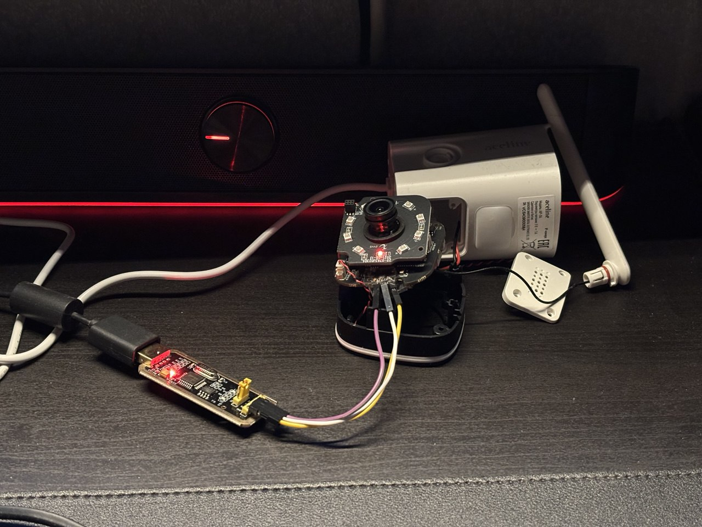

В настройках терминала (я использовал *PuTTY*) указываем COM-порт USB-to-TTL адаптера (можно посмотреть в диспетчере устройств), Connection type - `serial`, baudrate - `115200`. Включаем питание камеры от штатного блока питания, и... в консоль посыпался лог загрузки!

Некоторые интересные моменты, которые удалось сразу же понять из логов:
- `systemCommonConfigRead,1722] tip_led_switch: 1 telnetd_switch: 0 alarm_interval_sec: 60 sd_capacity_multiply: 1` сообщает нам о том, что `telnetd` не вырезан из прошивки, но программно отключён. Что ж, это очень хорошая новость.
- `00:00:17.267 11 CONET> ra0APStart,1387] is going... (ap0, gwIpv4=172.50.4.1)` даёт информацию о наличии Wi-Fi интерфейса, который является точкой доступа и статическим адресом шлюза назначается IP `172.50.4.1`. Отлично, это нам тоже пригодится.

Но **самая важная** строка в нем выглядела так:

```text
Hit any key to stop autoboot:  1     0 
```

**Уязвимость №1:** Загрузчик U-Boot не заблокирован. У нас есть ровно 1 секунда, чтобы нажать `Enter` и прервать загрузку ОС, получив консоль `isvp_t31#`. Просто спамим любую клавишу, прерываем процесс загрузки, и получаем промпт командной строки. Если не успели - просто перезагружаем камеру через отключение и включения питания.

Из консоли U-Boot мы можем изменить параметры загрузки ядра (`bootargs`). По умолчанию система монтирует ФС и просит логин/пароль, но командой `printenv` посмотрим, какие переменные загрузки сейчас установлены. Среди них нас интересует параметр, который сейчас выглядит как `init=/linuxrc`. 

Если мы поменяем этот параметр на `init=/bin/sh`, ядро после инициализации сразу выбросит нас в root-оболочку, минуя авторизацию и стандартные загрузочные скрипты. 

> Заменяя `init=linuxrc` на `init=/bin/sh`, мы даём команду ядру Linux вместо штатной программы инициализации (которая запускает службы и процесс login, требующий пароль) просто запустить оболочку командной строки с правами суперпользователя.

Копируем `bootargs` из вывода `printenv` и меняем там параметр `init`, после чего применяем новый конфиг через `setenv`.

```bash
# Команда в консоли U-Boot для перехвата загрузки
# Устанавливаем переменную init=/bin/sh
setenv bootargs 'tf=0 console=ttyS1,115200n8 mem=43520K@0x0 rmem=22016K@0x2A80000 init=/bin/sh rootfstype=squashfs root=/dev/mtdblock2 rw mtdparts=jz_sfc:256k(boot),1632k(kernel),2752k(rootfs),3136k(app),384k(syscfg),32k(flag),8M@0(all)'

# Запускаем процесс загрузки
boot
```

Важно отметить, что команда `setenv` сохраняет значения переменных только в рамках текущей сессии, и после перезагрузки изменения пропадут (для чистоты эксперимента - в самый раз).

После загрузки мы получили root (`/ #`). Но система в состоянии комы: ничего не смонтировано, драйверов нет, сервисы мертвы. Ну... значит попробуем оживить её вручную.

## Этап 3: Художественный фильм - "Сдампили"

Прежде чем мы начнем ковырять файлы инициализации, необходимо сделать полный дамп прошивки. Если камера "окирпичится", это будет наш единственный билет обратно.

### Используем программатор **CH341A** и SOP8-прищепку, чтобы подключиться напрямую к чипу памяти `GD25Q64C`. 

Важно не забыть предварительно обесточить плату, отключив штатный шлейф питания. Программатор сам подаёт напряжение на чип, и может работать в двух режимах 5V и 3.3V - не забываем проверить информацию о рабочем напряжении памяти, и переключить режим перемычкой на плате программатора, прежде чем подключаться к памяти.

(*Часто бывает, что память работает на 1.8V, и для таких случаев нужен понижающий адаптер. Благо, что для CH341A это довольно типовой "обвес", поэтому его купить можно на любом маркетплейсе.*)

Считываем все 8 Мб памяти с помощью NeoProgrammer (или аналогичной программы) и обязательно делаем проверку целостности получившегося дампа кнопкой `Verify IC` - программатор ещё раз прочитает данные с чипа, а затем побитно сравнит исходный и контрольный дамп. Если при чтении и при проверке получили `"Success"` - сохраняем дамп. Если видим ошибки, значит контакт был нестабильным и данные записались некорректно. Обычно, в таких случаях нужно установить прищепку получше и попробовать ещё раз. На это может уйти не одна попытка, но на мой взгляд это всё равно в разы удобнее и быстрее, чем выпаивать микросхему, снимать дамп, и потом припаивать обратно.

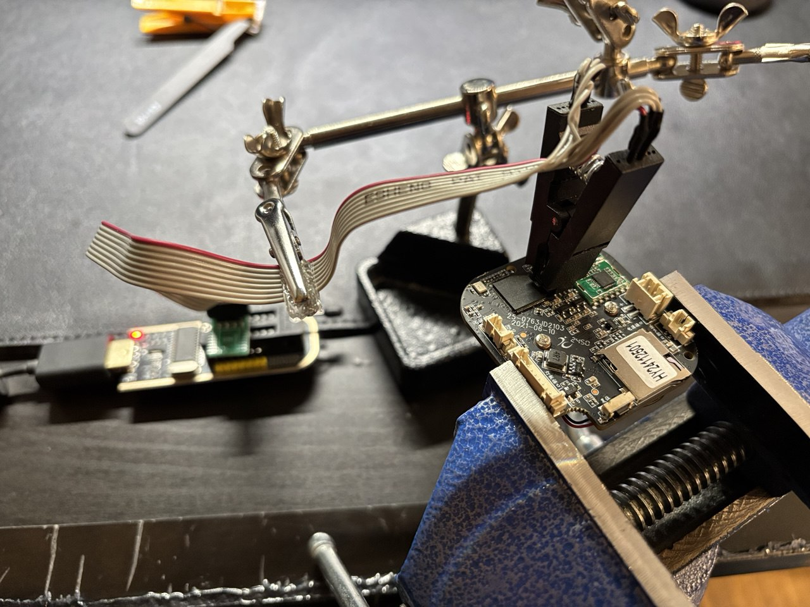
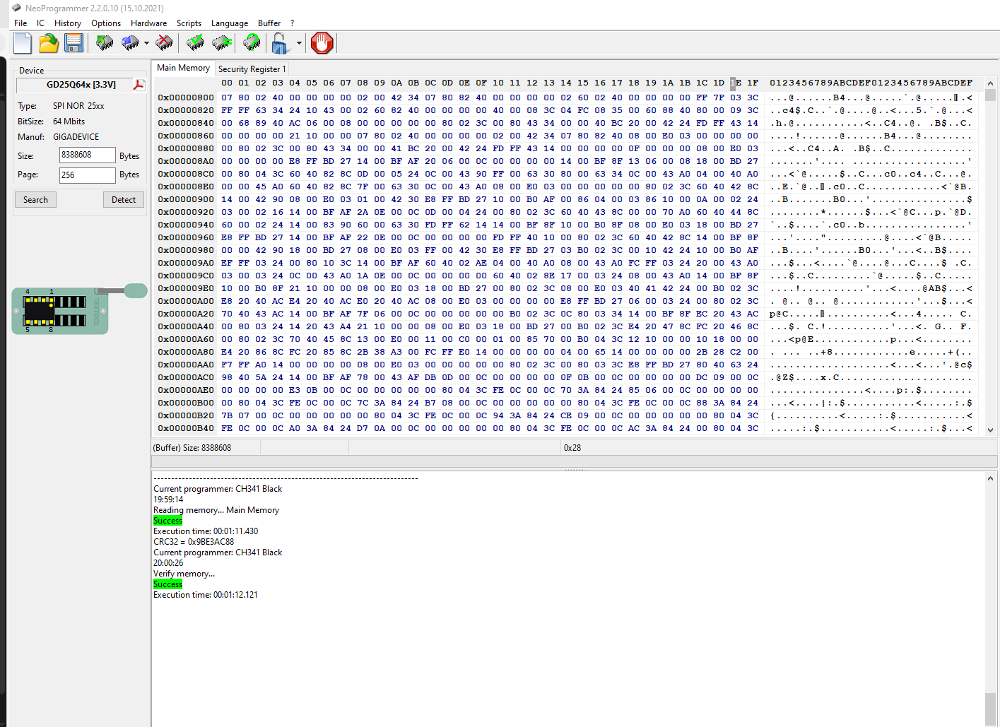

Дамп сохранен. Теперь можно действовать смелее.

В загрузчике U-Boot переменная `bootargs` заботливо хранила подробную карту разделов в памяти: `mtdparts=jz_sfc:256k(boot),1632k(kernel),2752k(rootfs),3136k(app),384k(syscfg),32k(flag),8M@0(all)`. На основе этих данных и более детального вывода binwalk мне удалось составить точную карту разделов.

### Карта разделов SPI Flash (8 MB)

| Смещение (HEX) | Размер (KB) | Раздел MTD | Содержимое по данным Binwalk | Описание |
| :--- | :--- | :--- | :--- | :--- |
| `0x000000` | 256 | `mtd0` | **U-Boot / SPL** (сигнатуры JBOOT, LZO) | Загрузчик и инициализация железа |
| `0x040000` | 1632 | `mtd1` | **uImage** (Linux Kernel 3.10.14) | Сжатое ядро ОС Linux |
| `0x1D8000` | 2752 | `mtd2` | **SquashFS** (RootFS) | Корневая система (Read-only) |
| `0x488000` | 3136 | `mtd3` | **SquashFS** (App) | Бинарники вендора (в т.ч. `initApp`) |
| `0x798000` | 384 | `mtd4` | **JFFS2** (SysCfg) | **RW раздел.** Хранит в основном конфиги |
| `0x7F8000` | 32 | `mtd5` | **Raw Data** (Flag) | Системные флаги и сброс настроек |
| `0x000000` | 8192 | `mtd6` | **Full Dump** | Весь образ целиком |

## Этап 4: Эволюция окружения - от "комы" к живой системе

Оказавшись в "голой" ОС через эксплойт U-Boot, нужно было найти способ штатно запустить систему с монтированием всех разделов, запуском служб и т.д., но при этом сохранить за собой права root. 

Немного покопавшись в системе из-под `root` (*всё ещё через UART-консоль и подцепленные к плате провода*) мне удалось обнаружить скрипт инициализации `/etc/init.d/rcS`. Этот скрипт выполняется при старте системы, о чём нам заботливо подсказывает `/etc/inittab`:

```bash
# Фрагмент /etc/inittab
# now run any rc scripts
::sysinit:/etc/init.d/rcS
```

Более подробный взгляд на содержимое `/etc/init.d/rcS` выявил **Уязвимость №2 (Логический бэкдор прямо от китайских разработчиков)**:

```bash
# Фрагмент /etc/init.d/rcS
# mount /var/syscfg
mkdir -p /var/syscfg
mount -t jffs2 /dev/mtdblock4 /var/syscfg

# start test.sh
if [ -f /var/syscfg/test.sh ];then
  sh /var/syscfg/test.sh &
else  # start boot.sh
  sh /bin/boot.sh &
fi
```

Разработчики оставили прекрасный хук! Если в разделе `/var/syscfg` (который, в отличие от `read only` корневой системы, смонтирован в JFFS2 и **доступен для записи**) существует файл `test.sh`, система выполнит его ВМЕСТО штатного `boot.sh`. Эти строчки в `/etc/init.d/rcS` буквально кричат **"ЗАНОСИТЕ СЮДА ВАШ БЭКДОР!"**

### Ручная сборка стенда
Но наша система пока всё ещё в коматозном состоянии, и в ней ничего не происходит. Поэтому, руководствуясь порядком команд из `/etc/inittab`, я вручную поднял систему, чтобы получить живое окружение:
```bash
/sbin/swapoff -a
mount -t tmpfs tmpfs /dev
mkdir -p /dev/pts
mkdir -p /dev/shm
mount -a
hostname -F /etc/hostname
/bin/sh /etc/init.d/rcS
```
Система загрузилась штатно. Запустились все сервисы (веб-сервер, трансляция RTSP, облачные демоны и т.д.). Это уже большой прогресс! С каждым шагом становится понятнее как тут вообще всё устроено, и "магия" становится просто набором скриптов и команд.

В UART тут же полетел спам логов от всевозможных сервисов. Из-за этого стремительного потока *невероятно полезной* информации, команды приходилось отправлять "вслепую" - пока вводишь команду, она визуально уже "улетела" куда-то вверх вместе с логами. На это нужно просто забить, и допечатав команду (или вставив команду из буфера) смело нажимать Enter - команда выполнится.

Чтобы комфортнее взаимодействовать с подопытным, я подключился к Wi-Fi точке доступа, которую раздаёт камера, после чего поднял `telnetd` на самой камере:

```bash
telnetd -l /bin/sh -p 23 &
```

Кроме того, выяснилась неприятная деталь: при штатной инициализации камера поднимает незапароленную точку доступа для первоначальной настройки со смартфона. Оставлять её открытой - значит потенциально пустить кого угодно в свою root-консоль.


Меня такой расклад не устроил, и я нашёл решение - на лету дописываем настройки WPA2 в конфигурацию `hostapd` и перезапускаем демон точки доступа:
```bash
echo "wpa=2" >> /var/hostapd.conf
echo "wpa_passphrase=MySecretPassword123" >> /var/hostapd.conf
echo "wpa_key_mgmt=WPA-PSK" >> /var/hostapd.conf
echo "wpa_pairwise=TKIP CCMP" >> /var/hostapd.conf
echo "rsn_pairwise=CCMP" >> /var/hostapd.conf
killall hostapd && hostapd -B /var/hostapd.conf
```
*(Опционально: на этом этапе, когда вся файловая система уже смонтирована, мы можем сделать бэкапы разделов на вставленную SD-карту с помощью `cat /dev/mtdX > /mnt/mmc/mtdX.bin`, где `X` - номер нужного раздела)*.

После активации режима точки доступа (AP Mode) камера поднимает DHCP-сервер и назначает себе статический IP-адрес шлюза точки доступа. В логах мы уже видели вот такая строку, где можно этот самый адрес и увидеть:

```bash
00:00:03.336 08 CONET> loadNetIni,2844] net support:eth0=1 ra0=1 bStaticIpFlag=0 gs_cAp0GwIpv4=172.50.4.1
```

Поэтому всё - подключаемся к Wi-Fi с паролем, и залетаем в root shell по `telnet 172.50.4.1` словно к себе домой.

## Этап 5: Автоматизация и закрепление бэкдора

Теперь, когда концепт доказан, мы напишем скрипты, которые камера будет исполнять при каждом включении сама. Для гибкости и удобства мы разделим логику на загрузчик (сохраняется во внутреннюю память и остаётся там даже после перезагрузки) и полезную нагрузку (хранится на SD-карте для удобства редактирования).

**1. Создаем загрузчик `test.sh`:**
Чуть позже мы поместим этот загрузчик в `/var/syscfg/test.sh`. Скрипт первым делом запускает штатную загрузку камеры (`/bin/boot.sh`), а затем раз в секунду в течение 30 секунд "пингует" наличие смонтированной SD-карты и скрипта с бэкдором на ней. Если находит - выполняет скрипт (*с `root` правами*), а если не находит (*не вставлена SD-карта или на ней нет скрипта*) - просто ничего не делает, чтобы всё работало как обычно.

```bash
#!/bin/sh
# Запускаем штатную загрузку камеры
sh /bin/boot.sh &

# Проверяем наличие на SD-карте файла с командами
# Если файл найден - выполняем
timeout=30
while [ $timeout -gt 0 ]; do
    if [ -f /mnt/mmc/backdoor.sh ]; then
		sh /mnt/mmc/backdoor.sh &
		break
	fi
    timeout=$((timeout-1))
	sleep 1
done
```

**2. Создаем Payload `backdoor.sh` (на SD-карте):**
Этот скрипт открывает Telnet-порт 23, отдавая нам root shell, и защищает заводскую точку доступа Wi-Fi паролем.

```bash
#!/bin/sh
# Поднимаем root-консоль
telnetd -l /bin/sh -p 23 &

# Ждем формирования конфига точки доступа
timeout=60
while [ $timeout -gt 0 ]; do
	if [ -f /var/hostapd.conf ]; then
		break
	fi
    timeout=$((timeout-1))
	sleep 1
done
sleep 1

# Перезапускаем точку доступа, 
# предварительно установив на неё пароль
killall hostapd
{
echo "wpa=2"
echo "wpa_passphrase=MySecretPassword123"
echo "wpa_key_mgmt=WPA-PSK"
echo "wpa_pairwise=TKIP CCMP"
echo "rsn_pairwise=CCMP"
} >> /var/hostapd.conf
sleep 1
hostapd -B /var/hostapd.conf &
```

**Инжект:**
Используя SD-карту и наш временный root-доступ через UART, копируем скрипт `test.sh` в системный раздел смонтированный в read-write режиме:
```bash
cp /mnt/mmc/test.sh /var/syscfg/test.sh
chmod +x /var/syscfg/test.sh
sync
sync
```
Перезагружаем устройство с установленной "волшебной" SD-картой, и идём открывать шампанское (и `telnet`).

Подключаемся к (*уже запароленной*) Wi-Fi точке доступа, открываем терминал (*в моём случае Powershell*), подключаемся к камере по `telnet 172.50.4.1` и получаем root-shell:

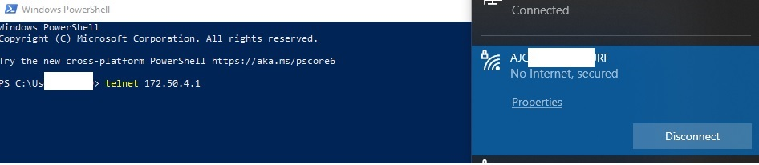

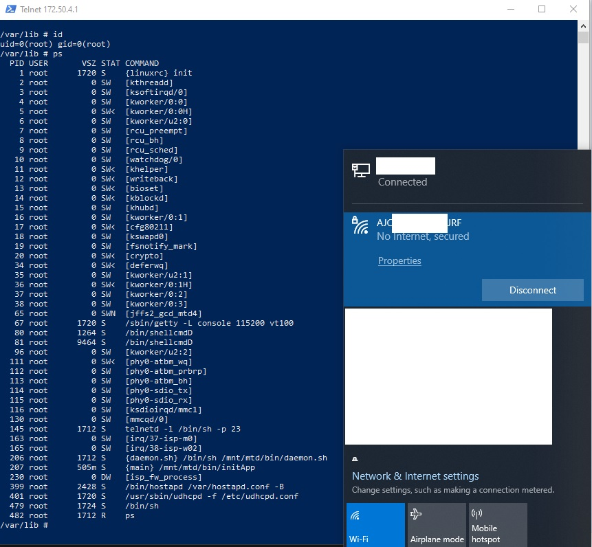

Всё, теперь можно отключаться от UART и собирать камеру обратно в корпус. Дальнейшее исследование системы куда удобнее продолжать через беспроводной root shell, чем через проводной UART.

## Итоги

Для конечного пользователя типовое IoT-устройство обычно выглядит как абстрактный "чёрный ящик", внутренняя логика которого скрыта за удобным мобильным приложением и облачными сервисами. Это нередко создает ложное ощущение закрытости и надежности системы. Однако аппаратный аудит может быстро разрушить эту иллюзию.

Как показала практика, за фасадом обычного бытового гаджета скрывается старый добрый Linux и классический стек технологий, изобилующий стандартными точками входа и логическими ошибками:

- Нераспаянный, но активный UART-интерфейс на плате
- Незаблокированный загрузчик U-Boot с возможностью изменения bootargs
- Отсутствие верификации загрузочных скриптов (оставленный разработчиками хук test.sh в RW-разделе)
- Использование устаревшего ПО с банальными уязвимостями конфигурации (веб-сервер с открытым корнем SD-карты и Path Traversal)

Громкие истории про "взлом сети через умный чайник" перестают казаться хакерской магией, когда понимаешь, что в их основе могут лежать вот такие архитектурные недочеты, кривые конфиги и оставленные на производстве отладочные бэкдоры.

Напоследок приведу схему, демонстрирующую пройденные этапы и общую последовательность загрузки устройства.

### Этапы исследования:
```text

Camera
   │
   ├─ UART → U-Boot
   │        │
   │        └─ bootargs → init=/bin/sh
   │
   ├─ root shell
   │
   ├─ rcS analysis
   │
   └─ /var/syscfg/test.sh
           │
           └─ persistent backdoor
```
### Последовательность загрузки устройства:
```text
SPI flash
   │
   └── U-Boot
          │
          └── Kernel
                 │
                 └── /etc/inittab
                        │
                        └── /etc/init.d/rcS
                               │
                               └── /var/syscfg/test.sh
									 │
									 └── /mnt/mmc/backdoor.sh
										   │
										   └── /bin/boot.sh
```

## Бонус
В процессе изучения конфига веб-сервера `boa.conf` я заметил вот такой параметр - `DocumentRoot /mnt/mmc`, который говорит нам о том, что корневая директория веб-сервера это... корневая директория SD-карты! Вероятно, файлы с SD-карты раздаются веб-сервером через простые GET запросы.

**Уязвимость №3**: после короткого теста через Postman была найдена и подтверждена классическая уязвимость **Path Traversal**. 

Уязвимость возникает из-за того, что веб-сервер раздаёт файлы из директории `/mnt/mmc`, но не фильтрует последовательности `../` в URL.

URL адрес запроса, составленный определённым образом, позволяет выйти за пределы `DocumentRoot`, и веб-сервер (который в данном случае имеет `root`-права) любезно отдаст вам совершенно любой файл из системы.

Даже без физического вмешательства и разборки корпуса камеры, потенциальный злоумышленник, находясь в одной Wi-Fi сети с устройством, может скачать любые файлы, которые лежат в основной файловой системе ОС камеры или на подключённой к ней SD-карте (*записи видео, логи, фото, хеши паролей из `/etc/shadow`, и т.д.*).

В качестве демонстрации получим `/etc/shadow` через GET запрос на адрес `http://172.50.4.1/../../../../etc/shadow` :

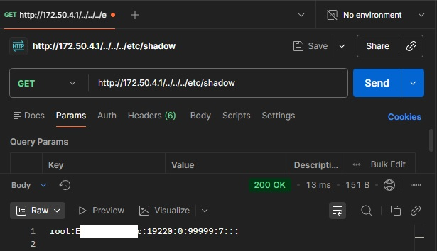
